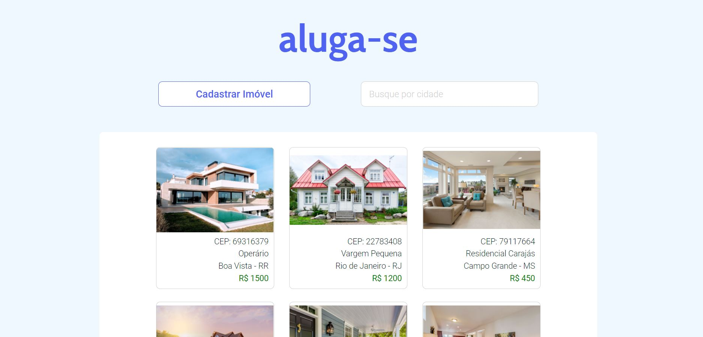

  

 
 

##  Projeto

Desafio proposto pela [Pris](https://pris.com.br/). A idéia do projeto era desenvolver uma aplicação fullsatck no âmbito de locação de imóveis. Para isso, era necessário criar uma interface, com a qual o usuário fosse capaz de interagir e performar cadastros e alterações no banco de dados da aplicação.

Uma demonstração do funcionamento do sistema pode ser vista no vídeo: [LINK](https://www.loom.com/share/32dad75f8c754e48a9f4bb60911a3e96)

##  Tecnologias

### Front-end

O front-end da aplicação foi desenvolvido com a biblioteca de JavaScript, ReactJs. A estilização da interface foi obtida com CSS puro. Neste projeto, optei por utilizar o padrão de arquitetura _Flux_ proposto pela própria empresa mantenedora do ReactJs, o Facebook. Os endereços dos imóveis são obtidos pela [API ViaCEP](https://viacep.com.br/). Os maiores desafios enfrentados na criação da interface foram:

- Manutenção do estado global da aplicação, tendo em vista as diversas chamadas assíncronas realizadas pelo front-end a cada operação do usuário.
- Criação do componente para o upload de imagens, assim como o método correto de envio de tais informações para o servidor.
- Lógica implementada para a paginação dos resultados.

Tecnologias utilizadas:
- JavaScript, HTML, CSS
- [ReactJs](https://reactjs.org/) (_Flux_ _Pattern_)
- [axios](https://github.com/axios/axios) 
- [react-dropzone](https://github.com/react-dropzone/react-dropzone) 

### Back-end

Para o back-end da aplicação utilizei o _framework_ Node.js para a execução de código JavaScript no lado do servidor. O banco de dados utilizado foi o Microsoft SQL Server e o _script_ resultante da criação das tabelas se encontra na pasta deste repositório. Foi empregue uma arquitetura de _models_ e _controllers_ para melhor desacoplamento das camadas. Os maiores desafios enfrentados foram:

- Dificuldade em encontrar informações sobre o método ideal de conexão com o SQL Server. Após ler a documentação de diversas alternativas, optei por utlizar o ORM Sequelize.
- Planejamento das diversas rotas a serem implementadas.
- Manipulação dos arquivos de imagem.

Tecnologias utilizadas:
- MS SQL Server
- [Node.js](https://nodejs.org/en/) 
- [Sequelize](https://sequelize.org/) 
- [multer](https://www.npmjs.com/package/multer) 

## Como usar

### Front-end

- É necessário ter o [Node.js](https://nodejs.org/en/) e [npm](https://www.npmjs.com/) instalados
- Clone esse repositório: `git clone https://github.com/romaSilva/VUTTR-BossaBox.git`
- Abra o terminal na pasta: `web`
- Instale as dependências do projeto, digitando no terminal: `npm install`
- Enfim, para rodar a aplicação digite: `npm start`

### Back-end

- É necessário ter o [Node.js](https://nodejs.org/en/) e [npm](https://www.npmjs.com/) instalados
- Clone esse repositório: `git clone https://github.com/romaSilva/VUTTR-BossaBox.git`
- Abra o terminal na pasta: `server`
- Instale as dependências do projeto, digitando no terminal: `npm install`

Criação e conexão com o banco de dados: 
- Criação do banco pelo [SQL Server Management Studio](https://docs.microsoft.com/en-us/sql/ssms/download-sql-server-management-studio-ssms?view=sql-server-ver15)
- A conexão com o banco deve ser configurada no arquivo: `server/src/config/database.js`
- Para testar a conexão, basta executar: `node src/database/connection.js`
- Todas as tabelas do banco foram criadas por meio de _migrations_, para executá-las basta digitar: `npx sequelize-cli db:migrate`, assim as tabelas serão criadas.

Enfim, para rodar o servidor, digite: `npm run node-dev`

##  Como contribuir

- Faça um fork desse repositório;
- Cria uma branch com a sua feature: `git checkout -b minha-feature`;
- Faça commit das suas alterações: `git commit -m 'feat: Minha nova feature'`;
- Faça push para a sua branch: `git push origin minha-feature`.

Depois que o merge da sua pull request for feito, você pode deletar a sua branch.